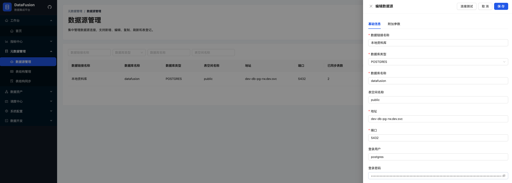
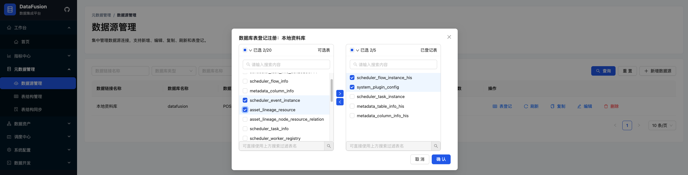
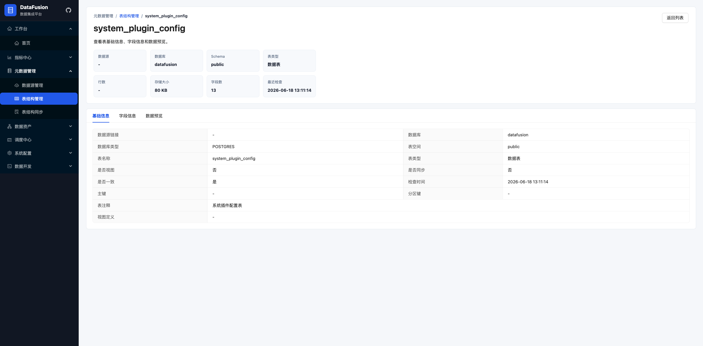
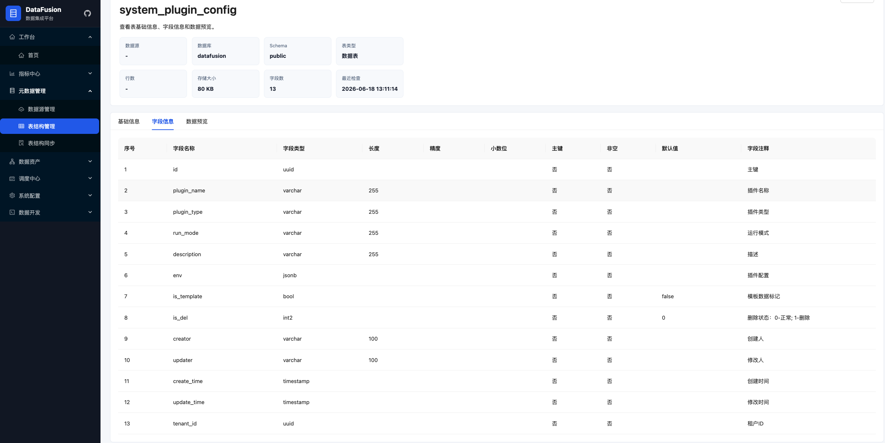
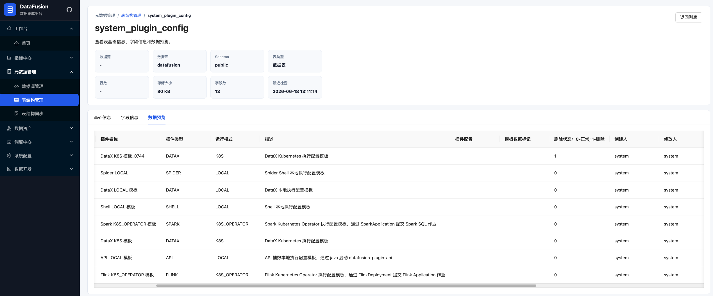
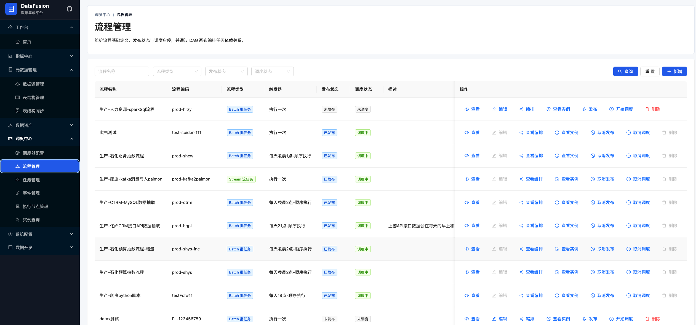
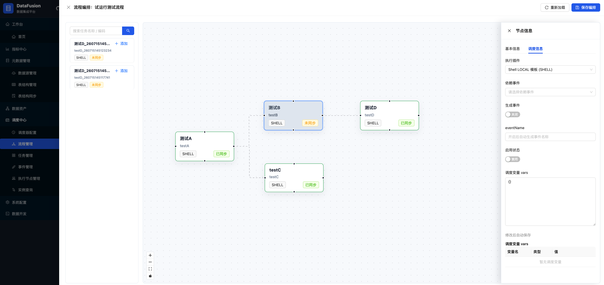
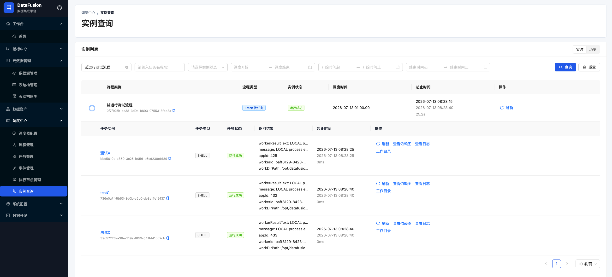
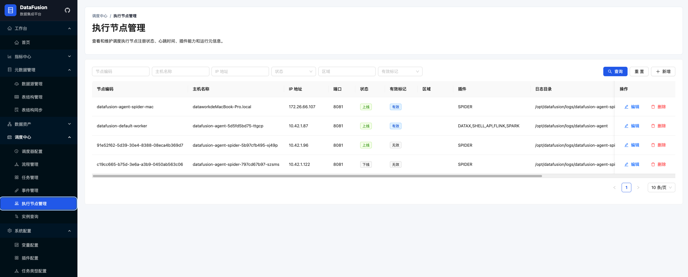
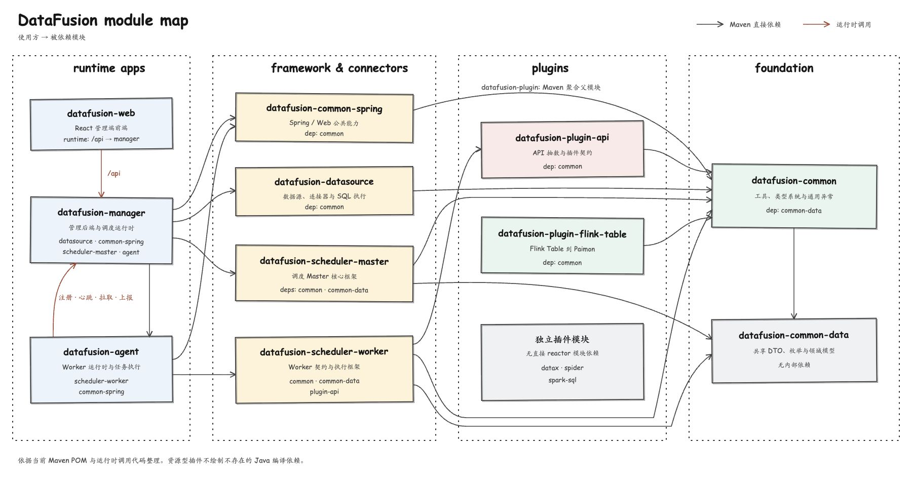

# DataFusion

DataFusion 是一个为 Data Agent 提供数据支撑的工具平台。平台围绕 Data Agent 对数据发现、接入、开发、理解、治理和执行的需求，提供以下工具能力：

- 元数据管理：管理数据源、库表结构、字段及其元数据信息。
- 数据集成：通过 DataX、API、Spider 等插件接入和同步数据。
- 数据开发：提供 SQL 脚本开发、执行路由及开发任务管理能力。
- 数据资产：组织数据资产、血缘关系及相关外部系统信息。
- 数据治理：为数据标准化、数据关系探索和数据地图建设提供工具能力。
- 数据调度：管理任务定义、流程编排、触发器、运行实例、执行节点和插件化任务执行。

各模块的当前实现范围以代码和 [`docs/`](docs/) 中的设计文档为准；Roadmap 中的能力表示后续建设方向，不代表当前已经完整交付。

## Roadmap

| 阶段 | 目标 | 状态 |
|------|------|------|
| 元数据管理 | 数据源接入、库表字段同步、表结构查看 | 当前主线 |
| 数据调度 | 任务定义、流程 DAG、触发器、实例管理、Worker 注册与插件执行 | 当前主线 |
| 插件执行 | Shell、DataX、API、Spider、Flink K8S_OPERATOR、Spark K8S_OPERATOR | 按插件文档持续完善 |
| 数据集成 | DataX 任务生成、插件化运行、K8s 作业执行 | 进行中 |
| 实时/湖仓写入 | Kafka JSON 到 Paimon、Spark SQL 到 Paimon | 进行中 |
| 数据开发 | SQL 脚本、执行路由、开发态任务沉淀 | 规划中 |
| 数据资产和血缘 | 资产节点、血缘图谱、SkyWalking / OSS / Git 集成 | 规划中 |
| 数据治理增强 | 表级维度键探索、数据地图索引 | 规划中 |
| 平台化运维 | 多环境部署、插件发布、监控告警、权限边界 | 规划中 |

## 系统截图

以下截图覆盖元数据接入、结构识别、调度编排和任务执行链路。点击图片可查看原始尺寸。

### 元数据管理

| 数据源连接配置 | 数据库表登记 |
|----------------|--------------|
| [](docs/assets/datafusion-metadata-datasource-1.png) | [](docs/assets/datafusion-metadata-datasource-2.png) |

| 表基础信息 | 字段结构 |
|------------|----------|
| [](docs/assets/datafusion-metadata-table-1.png) | [](docs/assets/datafusion-metadata-table-2.png) |

**数据预览**

[](docs/assets/datafusion-metadata-table-3.png)

### 数据调度与执行

| 流程管理 | DAG 流程编排 |
|----------|---------------|
| [](docs/assets/datafusion-scheduler-1.png) | [](docs/assets/datafusion-scheduler-2.png) |

| 调度实例查询 | 执行节点管理 |
|--------------|--------------|
| [](docs/assets/datafusion-scheduler-3.png) | [](docs/assets/datafusion-agent-1.png) |

## 一版还建议补充

- 初始化数据库说明：`datafusion-manager/src/main/resources/init_db/` 下 DDL、初始化数据和执行顺序。
- 配置样例：本地开发、Nacos dev / test / prod、K8s ConfigMap / Secret 的最小配置模板。
- 演示数据：持续维护一套可公开、可复现的元数据源和调度任务示例。
- API 文档入口：如果后续启用 OpenAPI / Knife4j，可以在 README 增加访问地址。
- 常见问题：Nacos 连接、数据库连接、Agent 注册失败、插件目录/PVC、K8s 权限不足。

## 项目部署

### 环境要求

| 组件 | 建议版本 | 说明 |
|------|----------|------|
| JDK | 17 | 父 POM 声明 Java 17 |
| Maven | 3.8+ | 后端多模块构建 |
| Node.js | 22+ | `datafusion-web` 构建和开发 |
| npm | 随 Node | 前端依赖安装 |
| MySQL / 兼容数据库 | 按运行配置 | Manager 业务库 |
| Nacos | 生产 / 测试环境 | 配置中心和注册中心 |
| Kubernetes | 生产容器部署 | 运行 Manager、Agent、Web 和插件任务 |

### 编译

```bash
mvn -DskipTests compile
```

```bash
mvn -DskipTests package
```

前端：

```bash
cd datafusion-web
npm ci
npm run build
```

### 环境层级

DataFusion 按两层环境理解启动方式：

| 层级 | 后端模式 | 前端模式 | 说明 |
|------|----------|----------|------|
| 本地级 | `local` | `local`（Vite `development`） | 不依赖 Nacos，前端代理到本地 Manager |
| 生产级 / Nacos | `dev`、`test`、`prod` | `dev`、`test`、`prod`（Vite `production`） | 后端从 Nacos 读取配置并注册发现，前端按环境指向对应 Manager 地址 |

说明：

- Manager 和 Agent 均提供 `local`、`dev`、`test`、`prod` profile；`dev/test/prod` 默认分别读取 `{applicationName}-{env}` Nacos dataId。
- 前端不直接连接 Nacos。应用环境分为 `local/dev/test/prod`，分别映射到 Vite `development/dev/test/production` mode。开发服务器由 `VITE_API_TARGET` 代理到对应 Manager，容器内由 Nginx 反向代理 `/api`。

### 本地级：local 模式

本地启动适合开发调试。Manager 需要可用的数据库、Redis / Redisson、OSS、Git、ETL、SkyWalking 等配置；如果不使用 Nacos，需要通过本地配置或环境变量补齐。

后端 Manager 使用 `local` profile：

```bash
mvn -pl datafusion-manager -am spring-boot:run -Dspring-boot.run.profiles=local
```

Agent 使用 `local` profile，并注册到本地 Manager：

```bash
mvn -pl datafusion-agent -am spring-boot:run -Dspring-boot.run.profiles=local
```

前端本地级通过 `npm run dev:local` 启动，读取 `.env.development` 中的 `VITE_APP_ENV=local`，并使用 `.env` 中的公共代理默认值 `http://localhost:8080`：

```bash
cd datafusion-web
npm run dev
```

```bash
cd datafusion-web
VITE_API_TARGET=http://127.0.0.1:8080 npm run dev:local
```

本地 jar 启动：

```bash
java -jar datafusion-manager/target/datafusion-manager-1.0.0.jar --spring.profiles.active=local
```

```bash
DATAFUSION_MANAGER_URL=http://127.0.0.1:8080 \
java -jar datafusion-agent/target/datafusion-agent-1.0.0.jar --spring.profiles.active=local
```

### 生产级：Nacos 模式

Nacos 模式包含 `dev`、`test`、`prod` 三类环境。后端通过 Spring profile 和 Nacos 参数读取外部配置；前端通过构建 mode 和 `VITE_API_TARGET` 指向对应环境的 Manager。

后端常用环境变量：

| 变量 | 说明 |
|------|------|
| `NACOS_SERVER_ADDR` | Nacos 地址 |
| `NACOS_NAMESPACE` | Nacos namespace |
| `NACOS_GROUP` | Nacos group |
| `NACOS_USERNAME` | Nacos 用户名 |
| `NACOS_PASSWORD` | Nacos 密码 |
| `NACOS_CONFIG_DATA_ID` | 指定 Nacos 配置 dataId，例如 `datafusion-manager-prod` |
| `DATAFUSION_ENV` | 参与默认 dataId 拼接，例如 `prod` |
| `DATAFUSION_MANAGER_URL` | Agent 访问 Manager 的地址 |

后端 `dev` 使用 `bootstrap-dev.yml`，默认读取 Nacos 中的 `datafusion-manager-dev` 和 `datafusion-agent-dev`：

```bash
NACOS_SERVER_ADDR=127.0.0.1:8848 \
NACOS_NAMESPACE=dev \
NACOS_GROUP=DEFAULT_GROUP \
NACOS_USERNAME=nacos \
NACOS_PASSWORD=nacos \
java -jar datafusion-manager/target/datafusion-manager-1.0.0.jar --spring.profiles.active=dev
```

```bash
NACOS_SERVER_ADDR=127.0.0.1:8848 \
NACOS_NAMESPACE=dev \
NACOS_GROUP=DEFAULT_GROUP \
NACOS_USERNAME=nacos \
NACOS_PASSWORD=nacos \
DATAFUSION_MANAGER_URL=http://datafusion-manager:8080 \
java -jar datafusion-agent/target/datafusion-agent-1.0.0.jar --spring.profiles.active=dev
```

后端 `test` 示例：

```bash
NACOS_SERVER_ADDR=127.0.0.1:8848 \
NACOS_NAMESPACE=test \
NACOS_GROUP=DEFAULT_GROUP \
NACOS_USERNAME=nacos \
NACOS_PASSWORD=nacos \
java -jar datafusion-manager/target/datafusion-manager-1.0.0.jar --spring.profiles.active=test
```

```bash
NACOS_SERVER_ADDR=127.0.0.1:8848 \
NACOS_NAMESPACE=test \
NACOS_GROUP=DEFAULT_GROUP \
NACOS_USERNAME=nacos \
NACOS_PASSWORD=nacos \
DATAFUSION_MANAGER_URL=http://datafusion-manager:8080 \
java -jar datafusion-agent/target/datafusion-agent-1.0.0.jar --spring.profiles.active=test
```

后端 `prod` 示例：

```bash
NACOS_SERVER_ADDR=127.0.0.1:8848 \
NACOS_NAMESPACE=prod \
NACOS_GROUP=DEFAULT_GROUP \
NACOS_USERNAME=nacos \
NACOS_PASSWORD=nacos \
java -jar datafusion-manager/target/datafusion-manager-1.0.0.jar --spring.profiles.active=prod
```

```bash
NACOS_SERVER_ADDR=127.0.0.1:8848 \
NACOS_NAMESPACE=prod \
NACOS_GROUP=DEFAULT_GROUP \
NACOS_USERNAME=nacos \
NACOS_PASSWORD=nacos \
DATAFUSION_MANAGER_URL=http://datafusion-manager:8080 \
java -jar datafusion-agent/target/datafusion-agent-1.0.0.jar --spring.profiles.active=prod
```

前端使用对应 mode 连接各 Nacos 环境中的 Manager：

```bash
cd datafusion-web
VITE_API_TARGET=https://datafusion-dev.example.com npm run dev:dev
VITE_API_TARGET=https://datafusion-test.example.com npm run dev:test
VITE_API_TARGET=https://datafusion.example.com npm run dev:prod
```

前端按环境构建：

```bash
cd datafusion-web
npm run build:dev
npm run build:test
npm run build:prod
```

仓库按 Vite 官方规则维护 `.env`、`.env.development`、`.env.dev`、`.env.test`、`.env.production`。`.env` 只放所有 mode 共享的默认值；`.env.local` 和 `.env.*.local` 是被 Git 忽略的个人覆盖文件。前端生产包始终请求同源 `/api`，`VITE_API_TARGET` 主要用于本地 Vite 代理，容器后端地址由 `nginx.conf` 管理。

### 容器镜像

仓库提供三个 Dockerfile：

| 模块 | Dockerfile | 默认端口 |
|------|------------|----------|
| Manager | `datafusion-manager/Dockerfile` | 8080 |
| Agent | `datafusion-agent/Dockerfile` | 8081 |
| Web | `datafusion-web/Dockerfile` | 80 |

构建前先产出 jar / 前端构建上下文：

```bash
mvn -DskipTests package -pl datafusion-manager,datafusion-agent -am
```

```bash
docker build -t datafusion-manager:1.0.0 datafusion-manager
docker build -t datafusion-agent:1.0.0 datafusion-agent
docker build --build-arg VITE_MODE=prod -t datafusion-web:1.0.0 datafusion-web
```

容器默认 profile 见各 Dockerfile，生产环境建议通过环境变量覆盖 `SPRING_PROFILES_ACTIVE`、Nacos 参数和运行时目录。

### Kubernetes / 生产部署

K8s 清单位于 [docs/k8s](docs/k8s/)，包括 Nacos、Manager、Agent、Web、PVC、Service、LoadBalancer 和 Ingress。

基本顺序：

```bash
kubectl apply -f docs/k8s/datafusion-common.yml
kubectl apply -f docs/k8s/datafusion-common-pvc.yml
kubectl apply -f docs/k8s/ext/nacos.yml
kubectl apply -f docs/k8s/datafusion-manager.yml
kubectl apply -f docs/k8s/datafusion-agent.yml
kubectl apply -f docs/k8s/datafusion-web.yml
```

外部访问按需启用：

```bash
kubectl apply -f docs/k8s/datafusion-manager-lb.yml
kubectl apply -f docs/k8s/datafusion-agent-lb.yml
kubectl apply -f docs/k8s/datafusion-web-lb.yml
kubectl apply -f docs/k8s/datafusion-manager-ingress.yml
kubectl apply -f docs/k8s/datafusion-web-ingress.yml
```

部署前必须替换镜像、Nacos namespace、Secret、PVC / StorageClass、Ingress 域名和外部依赖配置。详细说明见 [Kubernetes 部署说明](docs/k8s/README.md)。

## 项目开发规范

### 项目结构

DataFusion 采用 Maven 多模块结构。公共能力、调度框架、运行时应用和插件模块保持独立，当前目录及职责如下：

```text
datafusion/
├── datafusion-common-data                 跨模块共享 DTO、枚举和领域模型
│   └── com.datafusion/
│       ├── common                         通用共享对象
│       └── scheduler                      调度通信模型和枚举
├── datafusion-common                      轻量级公共工具、类型系统和通用异常
├── datafusion-common-spring               Spring/Web、分页、基础实体和类型处理器
├── datafusion-datasource                  数据源、连接器、SQL 执行和结果集映射
├── datafusion-scheduler-master            调度 Master 核心框架
├── datafusion-scheduler-worker            调度 Worker 契约和执行框架
├── datafusion-manager                     管理端后端与调度运行时
│   └── com.datafusion.manager/
│       ├── metadata                       元数据管理
│       ├── ingestion                      数据集成
│       ├── development                    数据开发
│       ├── asset                          数据资产与血缘
│       ├── scheduler                      调度管理
│       ├── system                         系统管理
│       ├── auth                           认证相关对象
│       ├── config                         应用配置
│       └── utils                          Manager 通用工具
├── datafusion-web                         React 管理端前端
├── datafusion-agent                       Worker 运行时、插件加载和任务执行
└── datafusion-plugin                      插件父模块
    ├── datafusion-plugin-api              API 抽数插件及公共插件契约
    ├── datafusion-plugin-datax            DataX 运行资源和任务模板
    ├── datafusion-plugin-flink-table      Flink Table 到 Paimon 插件
    ├── datafusion-plugin-spider           外部 Spider 运行时资源插件
    └── datafusion-plugin-spark-sql        Spark SQL 到 Paimon 插件
```

Manager 各业务域通常按 `controller`、`service`、`service.impl`、`dao`、`po`、`dto`、`vo`、`model`、`enums`、`constant` 分层；只创建业务实际需要的层级。

### 内部模块依赖

下图表示当前 POM 中的直接 Maven 依赖和主要运行时调用。箭头由使用方指向被依赖模块，模块框内列出直接依赖，便于在缩放后继续阅读。



图源：[datafusion-module-dependencies.html](docs/assets/datafusion-module-dependencies.html)。模块或 POM 依赖变化时，应先更新图源并重新生成图片。

`datafusion-plugin` 是插件聚合父模块，不表示运行时依赖。`datafusion-web` 不参与 Java 编译依赖，通过 `/api` 调用 Manager；Agent 通过内部调度接口向 Manager 注册、发送心跳、拉取任务并上报执行结果。

### 包结构和命名规范

Java 根包统一使用 `com.datafusion`，领域对象放在所属模块和业务域下，类路径与模块职责保持一致。

| 包名 | 职责 |
|------|------|
| `com.datafusion.***.controller` | HTTP 接口和请求校验，不承载业务规则 |
| `com.datafusion.***.service` | 业务接口、规则、事务边界和跨服务编排 |
| `com.datafusion.***.service.impl` | Service 实现 |
| `com.datafusion.***.dao` | 数据访问接口，通常与持久化对象对应 |
| `com.datafusion.***.po` | 持久化对象，通常与数据库表结构对应 |
| `com.datafusion.***.dto` | 接口和模块间传输对象 |
| `com.datafusion.***.vo` | 面向页面展示的组合对象，仅在 DTO 不能直接表达时使用 |
| `com.datafusion.***.model` | 框架或领域内部模型 |
| `com.datafusion.***.constant` | 常量定义 |
| `com.datafusion.***.enums` | 枚举定义 |

分层规则：

- Controller 按业务接口边界组织，多个页面可以复用同一 Controller；单个页面优先对接一个主 Controller，跨领域能力由 Service 编排。
- Service 与业务能力分类保持一致，跨业务调用优先依赖其他 Service，不在 Controller 中直接编排 Mapper 或外部系统。
- DAO 与持久化对象、数据库结构保持对应关系，自定义 SQL 必须使用参数绑定。
- `datafusion-common-data` 只下沉确实需要跨模块共享的对象，避免把单一运行时模块的内部模型扩散为公共契约。

### SDD 文档

项目使用结构化设计文档约定：

- 项目索引：[docs/.sdd/project-index.yml](docs/.sdd/project-index.yml)
- 项目约定：[docs/.sdd/project-conventions.md](docs/.sdd/project-conventions.md)
- 数据结构事实源：`*-data-define.md`
- 行为和流程设计：`*-design.md`

新增或修改功能时，先更新对应 data / design 文档，再改代码。外部运行时或资源引入型插件可以按索引中的 `design_only` 例外只保留 design 文档。

### 后端规范

- Java 使用 JDK 17。
- Controller 返回 `Result<T>`，保持薄控制层。
- Service 负责业务规则、事务边界、状态变化和外部集成编排。
- Mapper 通常继承 MyBatis-Plus `BaseMapper<Entity>`。
- 新增 JSON / Properties 字段时优先复用已有 MyBatis 类型处理器。
- 自定义 SQL 使用 `#{}` 绑定用户输入，禁止用 `${}` 拼接用户输入。

### 前端规范

- 前端源码位于 `datafusion-web/src`。
- 技术栈：Vite、React、TypeScript、Ant Design、Axios、React Query、React Router。
- 页面模块优先放在 `datafusion-web/src/modules/{feature}`。
- 模块常见文件：`api.ts`、`dto.ts`、`constants.ts`、`index.tsx`、`components/`。
- 统一 HTTP client：`datafusion-web/src/api/http.ts`。
- 路由集中维护：`datafusion-web/src/router/routes.tsx`。

### 常用验证命令

```bash
mvn -DskipTests compile
mvn -DskipTests compile -pl datafusion-manager -am
mvn -DskipTests compile -pl datafusion-agent -am
```

```bash
cd datafusion-web
npm run build
npm run lint
npm run test
```

## 模块介绍

| 模块 | 说明 | 文档 |
|------|------|------|
| `datafusion-common-data` | 跨模块共享 DTO、枚举和领域模型 | 无 |
| `datafusion-common` | 公共工具、类型系统、cron、SQL 模板、通用异常 | [docs/datafusion-common](docs/datafusion-common/) |
| `datafusion-common-spring` | Spring/Web DTO、分页对象、基础实体、MyBatis 类型处理器 | 无 |
| `datafusion-datasource` | 动态数据源、连接器、SQL 执行、结果集映射 | 无 |
| `datafusion-manager` | 主 Spring Boot 后端，包含 metadata、scheduler、system 等域 | [docs/datafusion-manager](docs/datafusion-manager/) |
| `datafusion-web` | 管理端前端应用 | [docs/datafusion-manager](docs/datafusion-manager/) |
| `datafusion-scheduler-master` | 调度 master 框架层 | [docs/datafusion-scheduler-master](docs/datafusion-scheduler-master/) |
| `datafusion-scheduler-worker` | 调度 worker 框架层 | [docs/datafusion-scheduler-worker](docs/datafusion-scheduler-worker/) |
| `datafusion-agent` | Worker 运行时应用层，负责注册、插件加载、任务执行和日志 | [docs/datafusion-agent](docs/datafusion-agent/) |
| `datafusion-plugin` | 插件父模块 | [docs/datafusion-plugin](docs/datafusion-plugin/) |
| `datafusion-plugin-api` | API 抽数插件 | [docs/datafusion-plugin/datafusion-plugin-api](docs/datafusion-plugin/datafusion-plugin-api/) |
| `datafusion-plugin-datax` | DataX 插件资源与任务模板 | 无 |
| `datafusion-plugin-flink-table` | Kafka JSON 到 Paimon 的 Flink 插件 | [docs/datafusion-plugin/datafusion-plugin-flink-table](docs/datafusion-plugin/datafusion-plugin-flink-table/) |
| `datafusion-plugin-spider` | 外部 Spider 运行时资源引入插件 | [docs/datafusion-plugin/datafusion-plugin-spider](docs/datafusion-plugin/datafusion-plugin-spider/) |
| `datafusion-plugin-spark-sql` | Spark SQL 到 Paimon 插件 | [docs/datafusion-plugin/datafusion-plugin-spark-sql](docs/datafusion-plugin/datafusion-plugin-spark-sql/) |

## 文档入口

- [SDD 项目索引](docs/.sdd/project-index.yml)
- [SDD 项目约定](docs/.sdd/project-conventions.md)
- [Agent 设计](docs/datafusion-agent/agent-design.md)
- [Scheduler Master 设计](docs/datafusion-scheduler-master/scheduler-master-design.md)
- [Scheduler Worker 设计](docs/datafusion-scheduler-worker/scheduler-worker-design.md)
- [Manager 调度文档](docs/datafusion-manager/)
- [Kubernetes 部署说明](docs/k8s/README.md)
